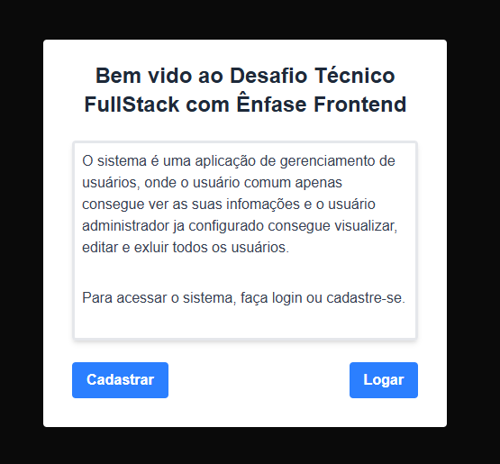
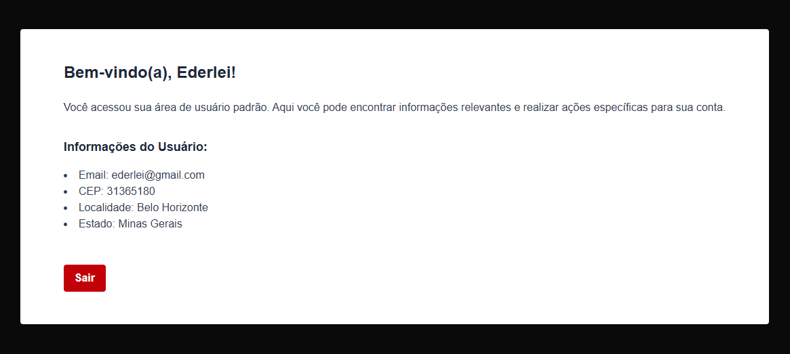

# Gerenciamento de usúarios
Desafio ténico FullStack.

1. Foi solicitado uma aplicação web simples de gerenciamento de usuários, utilizando Next.js, banco de dados relacional (preferencialmente SQLite) e utilizando a liguagem TypeScript

2. Funcionalidades esperadas

1. Cadastro públicode usuário
    1. O usuário precisa poder se cadastrar na aplicação de maneira pública.
    2. Campos obrigatórios: nome, e-mail e senha.
    3. Campos opcionais: CEP, estado e cidade.
    4. A senha precisa seguir regras especificas (a seu critério).
    5. O estado e a cidade devem ser preenchidos de uma API pública a partir do CEP.
2. Administrador inicial
    1. A aplicação deve possuir um administrador com acesso preconfigurado.
3. Login público
    1. Autenticação via email e senha.
    2. após o login, o usuário deve ser redirecionado para uma área autenticada.
4. Área autenticada do usuário comum
    1. O usuário deve visualizar uma mensagem de boas-vindas.
    2. O usuário autenticado pode visualizar seus próprios dados.
    3. O usuário não pode ver ou editar dados de outros usuários.
5. Área do administrador
    1. O administrador pode:
        1. Ver uma lista com todos os usuários.
        2. Editar nome do usuário.
        3. Deletar qualquer usuário.

## Funcionalidades da aplicação
- Foi criado a pagina home apenas com uma mensagem de "bem vindo ao desafio técnico" com dois botões, um que encaminha para a pagina de cadastro e outro para a pagina de login

- Na pagina de cadastro o usuario pode preencher os campos nome, email, senha sendo obrigatorios e CEP sendo opcional, assim que a pessoa sair do campo de CEP os outros campos de estado e cidade serão preenchidos automaticamente buscando da API ViaCEP. Nessa tela também tem o botão de enviar os dados para o banco de dados e o botão de cancelar que volta para a pagina inicial.

- Na pagina de login, o usuario preenche os campos de email e senha para poder logar no usuario dele, se for um usuario comum ele vai ser direcionado para uma pagina de boas vindas informando os dados dele salvo no banco de dados, ser for usuario administrador ele vai ser direcionado para a pagina mostrando uma lista de todos os usuarios cadastrados no banco de dados.

- Na pagina do usuario normal, tem apenas um botão de sair do usuario e voltar para a pagina de login novamente.

- Na pagina do usuario administrador ele terá a opção de editar o nome dos outros usuarios, a opção de exluir os usuarios do banco de dados e o botão de sair e voltar para a pagina de login.


<details>
<summary>Imagens da Aplicação</summary>







</details>

## Ferramentas Utilizadas
### Linguagens
1. Next.JS
    - Foi utilizado o Next.JS que foi solicitado no desafio, utilizei ele pela primeira vez e gostei muito de utilizar pois o tailwindcss ajuda muito na estilização.

---

2. TypeScript
    - Foi utilizado o TypeScript pois também foi solictado no desafio.
    
---

3. HTML
    - O HTML foi utilizado para renderizar na tela os resultados das funções criadas em TypeScript.
    
---

4. tailwindcss
    - Utilizei o tailwindcss pela primeira vez, fazendo a estilização de uma maneira bem mais facil na aplicação.

## Planejamento
No desenvolvimento do projeto, empreguei inicialmente o Notion para organização e gestão de tarefas, o que contribuiu para a estruturação do trabalho. Contudo, identifiquei um desafio significativo ao iniciar o desenvolvimento pelo frontend. Essa abordagem resultou em complexidades inesperadas na integração com o backend, especialmente devido à minha primeira experiência com SQLite e Next.js.

A falta de familiaridade com essas tecnologias demandou um tempo considerável para a depuração e resolução de problemas, incluindo a identificação e correção de um erro persistente relacionado ao cache do navegador. Essa experiência, embora desafiadora, proporcionou um aprendizado valioso sobre a importância da sequência de desenvolvimento e aprofundou minhas habilidades na resolução de problemas e na depuração de sistemas complexos.

## Comando para poder rodar a aplicação
### comandos para instalar no projeto antes de rodar em sua maquina
- Abra o terminal na raiz do projeto

- Verificar se o node js esta instalado na maquina
Para poder instalar os componentes do node js, para verifficar se tem o node em sua maquina pode usar o comando `node -v` se aparecer a versão quer dizer que ele esta instalado. Caso não apareça a versão baixe o node no link: https://nodejs.org/pt
    
```
node -v
```

- instalar componentes do NodeJs
Com o terminal aberto dentro dentro da raiz do projeto digite o comando abaixo:
    
```
npm install
```

- Iniciar a aplicação
Com todos as aplicações acima instaladas podemos iniciar a aplicação com o comando:
    
```
npm run dev
```

- Caso queira testar o usuário administrador

Email do usuário: admin@admin.com
Senha: admin 
